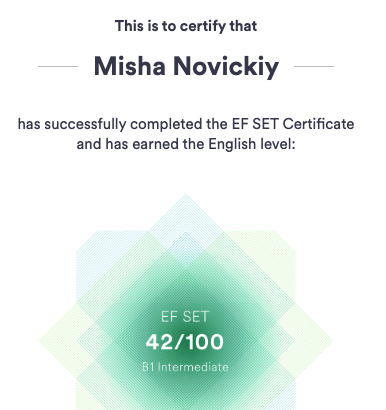

# Mikhail Novickiy

## Contact information
* Location: Minsk, Belarus
* Phone: +375 33 618-47-00
* Email: novickiy.mikhail@gmail.com
* GitHub: [MichaelNovickiy](https://github.com/MichaelNovickiy)
* [LinkedIn](https://www.linkedin.com/in/michaelnovickiy/)
* [Telegram](https://t.me/Michael_Novickiy)

## About myself
I am 24 years old, and I am a civil engineer. The last place of work was the construction of the Minsk metro. Now I devote all my free time to studying frontend, and I really like it, I hope I will be able to become a developer soon.

## Skills
* HTML
* CSS (SCSS).
* JavaScript (Fundamentals).
* React, Redux.
* Git (remote service GitHub).

## Code Examples
```
function numberToPower(number, power){
  var total = 1;
  for (var i = 1; i <= power; i++) { 
    total = total * number;
  }
  return total;
}
```
## Education
* Belarusian National Technical University
  * Civil engineer highways
* Courses
  * [IT-Incubator](https://it-incubator.ru/education/front-end)

## English
A2-B1 
[efset.org](https://www.efset.org/cert/3a5u5o)
